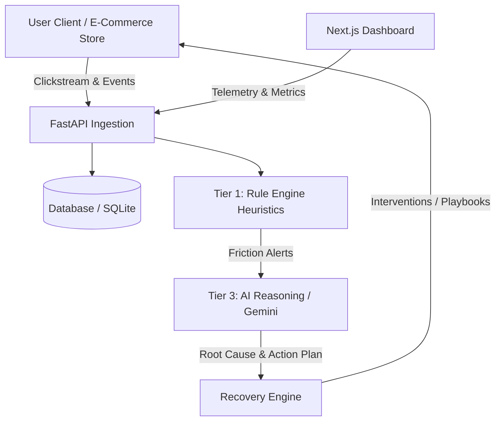

# Architecture Overview

## System Architecture

## Layers

1. **Backend**
   - `data_generation/`: Synthetic clickstream and scenario simulation scripts.
   - `rule_engine/`: Deterministic heuristic detection logic (Rage clicks, validation deadlock, hesitation, gateway failures).
   - `ai_reasoning/`: Multimodal / LLM reasoning with Gemini for deep diagnosis, churn estimation, and automated playbook generation.
   - `api/`: REST & WebSocket endpoints via FastAPI.
   - `db/`: Database schemas, ORM models, and persistence.

2. **Frontend**
   - `app/`: Next.js pages and layouts.
   - `components/`: Real-time dashboard, session playback stream, and recovery action interfaces.

3. **Docs**
   - `pitch/`: Presentation resources and concept deck.
   - `architecture.md`: System layout and workflow specifications.
